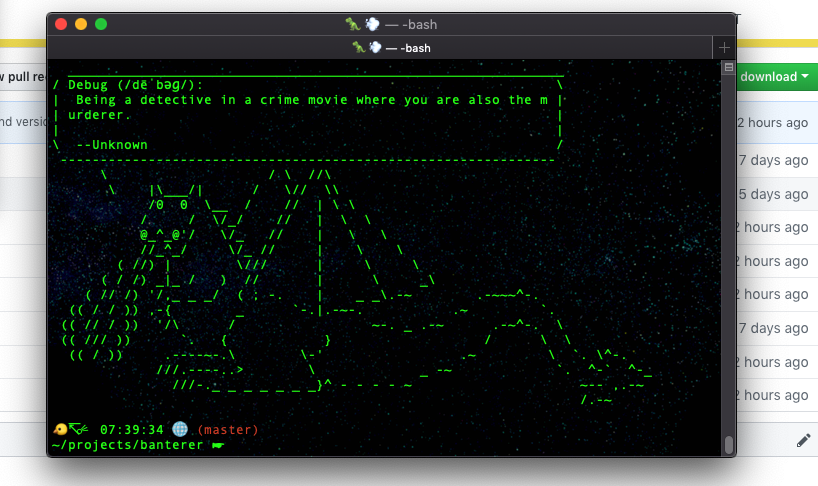

# 🗣 banterer

 - lighthearted and, at times, inspiring remarks on software for when you need to break up the monotony

## Install

```
$ npm install banterer
```

## Usage
### CLI (in your terminal):

```bash
# first, install globally
$ npm install -g banterer

# then you can run with any desired options
$ banterer [options]

```
You can even add this simple one-liner to your `.bashrc` or `.bash_profile` to get some banter anytime you start a new terminal session: `echo "$(npx -q banterer)"`

### AS A MODULE:
```js
const banterer = require("banterer");

console.log(banterer.random()); // returns random banter
console.log(banterer.random("react")); // returns random react banter
console.log(banterer.list()); // returns an array of all banter
console.log(banterer.list("react")); // returns an array of all react banter
```

### Options

```
-v, --version      output the version number
-l, --list         list all banter
-t, --tag <value>  filter banter with tag
-h, --help         output usage information
```

### Examples

```bash
$ banterer
$ banterer --tag react
$ banterer -t javascript
$ banterer --list
$ banterer -l
$ banterer -lt react
```

## Tags
Tags consider a curated list of tags associated with the banter as well as the text of the quote to determine matches.
